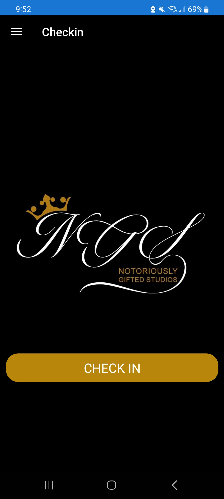

# **Small Business Example Andriod Application**  

 
  
 
  
 

## **📝 Project Description** 
NGS Studios is a sample application for small businesses designed, built, and tested using Xamarin forms(now MAUI). The app gives the business owner the ability to login, store client information, store worker information, track client visits, and market information to clients.

---

## **📸 Screenshots**  
 &nbsp; &nbsp;
 &nbsp; &nbsp;
 &nbsp;
---

## **🛠️ Features**  
✅ Feature 1 – *User Authentication via Firebase*  
✅ Feature 2 – *MVVM Architecture*  
✅ Feature 3 – *3rd Party Service Integration*  
✅ Feature 4 – *Cloud Storage of user data*  
✅ Feature 5 – *Seperate owner login*  
✅ Feature 6 – *New client checkin workflow*    

---

## **📦 Tech Stack**  
- **Languages:** XAMARIN, C#
- **Sercies:** Firebase Authentication, Firebase Real Time Database
- **Database:** FireBase Realtime Database
- **Tools & CI/CD:** Git
- **Platform:** Android
